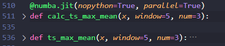

## 项目代码结构
### push到gitlab的代码部分:
  - feature_engineering/: 特征工程模块，运行一次后自动存储特征计算结果，如果没有新数据则不必重新运行，可以通过命令行参数跳过
    - apb.py: apb特征计算,包括日频的apb和日内分钟频的apb,一起计算,merge成dataframe一起返回
    - hf_feature.py: 提供duckdb计算基于分钟频数据的特征的方法
    - feature_engineering.py: 特征工程的主体代码和对外接口，调用另外两个模块apb和hf_feature，计算hf_feature会使用多进程；用dataframe计算除此之外的其他特征
  - deap_gp/: 主要功能代码
    - base/: cpu和gpu两种实现都会用到的、形式相同的辅助函数和自定义类
      - setup.py: 创建原始集（原始集是gp算法中用来存储树节点的容器，包括gp中会用到的算符和常数）,向原始集添加常数元素,
      - LimitedParetoFront.py: 继承自DEAP的ParetoFront, 用于多目标优化，但是添加了元素数量设置(原生的ParetoFront只能取第一前沿面的个体,无法控制数量)，在这个类中，如果第一帕累托前沿上的元素数量超过限制，则根据拥挤程度挑出最不拥挤的若干元素；若第一前沿上的个体数量不足，则顺次选取后续前沿中的个体，并按拥挤度排序
    - cpu/: cpu版本的函数
      - fitness.py: cpu版本的适应度计算，包括IC,ICIR,NDCG计算和barra风格相关性/中性化计算，每个指标的计算，最内部都用numba实现
        
      - operators.py: cpu版本的算符定义，对五个串行耗时的算子，使用numba并行实现，也是采用numba进行核心计算，外面包裹一层调用函数的方式
        
        
        
        
    - gpu/: gpu版本的函数，是cline对照cpu版本生成的，未经检查
    - data/: 数据处理模块，提供了一个基类，两个派生类，分别对应cpu和gpu的实现
      - processor_base: dataProcessor的基类，定义数据格式处理，清洗，切分
      - pandas_processor: cpu版本的派生类，具体实现上述功能，输入pandas格式数据，处理之后输出二维的numpy array，包括各基础特征的值、barra风格因子的值、WLS的权重值，都是以日期为行，股票为列的二维array
      - rapids_processor: gpu版本的派生类，用cupy，cudf等rapids库实现和cpu类似的功能，cline对照生成的，未经过检查
    - semantic/: in progress, AI写的，试图对DEAP原生的公式树生成，交叉变异函数进行包装，目的是附加语义检查，**没有在正式工作流中用过，不一定没有bug**
    - core.py: 实现GP的主线逻辑，是项目的主线代码，完成具体的种群生成/相关性筛选/适应度挑选/名人堂更新/结果输出，
        - 其中的入口main方法被entry.py调用
        - main方法本身通过调用prepare_data，让dataprocessor来把dataframe切分成numpy array，然后调用run_gp来进行gp的流程
        - run_gp在做好初始化(setup_toolbox和生成初始种群、设定随机数种子)之后，调用**自定义的规划流程eaMuPlusLambdaWithEarlyStopping(DEAP原生有几个ea函数可以开箱即用，这个也可以算是对DEAP的ea的大型重写)**，最后获取这个大函数输出的hof，对hof个体进行检测，保存hof个体和规划参数组合。**在常规的规划流程中，每轮规划的参数组合会保存在最终生成的best.json文件里，这个文件最初是用来保存最优个体的，不过因为hof.json中也会包含全部个体，所以这里面的参数组合反而比较重要；另外，earlystop_warmstart_bidirectionDynamicMutProb_parsimony这个文件夹（内含因子值，所以只有hpc本地有）里保存了一个运行结果样例，我手动把best.json的名字改成bestalpha&config.json了**
  - config.py: 定义了项目默认配置参数和参数加载函数
  - entry.py: 项目入口，调用参数加载函数，解析命令行参数，加载行情/特征/barra/WLS权重数据，调用deap_gp/core.py；其中的行情数据，既可以从数据库里读取，也可以从本地文件读取，也支持两边都读取再merge起来（其实最开始就的工作流就是这样的，后来merge过一次就完全读文件了）
  - operator_test.py: 用来测试cpu/operators.py和gpu/operators.py的算子实现与计算效率的模块，就是简单地把两个operators.py里的方法调用出来了，可以不用跑整个gp就能测试算子
  - nan_count.csv: 我对所有特征经过清洗处理之后的空值数量做了统计和正确性验证，结果记在这里面了
  - screenshot/: 这个readme里涉及的几张截图

### 保存在hpc本地的数据部分
  - features.parquet: 15-25年的特征数据文件
  - barra/:lncap,nls,rv,liquidity各自单独的因子值，barra.csv是rv和liquidity合并的因子值，weights是$`\sqrt{market\ value}$的值，都是dataframe的形式，一列时间一列标的一列数据
  - earlystop_warmstart_bidirectionDynamicMutProb_parsimony/: 一个实验结果样例,log.json里记录了每一代的最大/最小/平均ic
  - 几组results/: results_old是早期的基础版本实验，那时候名字还是默认的实验时间，没有开始进行对照试验；results是后来的对照试验结果；带_secucode后缀是因为早期因子值输出是以InnerCode作为标的列，要和Athena兼容所以专门做了一次替换，带后缀的目录下面的因子值文件是用secucode的；其中一部分results/目录下的对照试验，当时也需要进行Innercode转secucode；不过现在就不需要了，results中有些实验在results_secucode中没有出现，就是因为已经在gp过程中改成secucode了
  - runner/: 三十多个runner_value的因子值
  - secucode_innercode.csv: 项目中用InnerCode来作为标的的标识符，而Athena需要上传SecuCode，这是一张带时间的InnerCode与SecuCode的对照表，用于Code映射
  - test.ipynb: 整个开发过程中的一些杂代码，可能是小实验也可能是写法验证或者因子的基础分析，都是用完即抛的